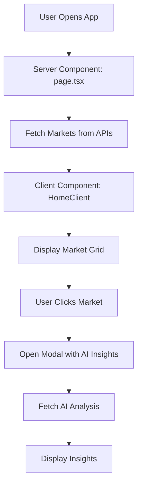

# 🚀 PredictHub Developer Guide

## 📋 **Project Overview**

**PredictHub** is a comprehensive prediction market aggregator that combines data from multiple platforms (Polymarket, Myriad, Limitless) with AI-powered insights and analysis.

### 🎯 **Core Features**
- **Multi-Platform Aggregation**: Polymarket, Myriad, Limitless Labs
- **AI-Powered Insights**: Sentiment analysis, price predictions, market intelligence
- **Real-Time Web Analysis**: News sentiment from DuckDuckGo API
- **Interactive UI**: Modern, responsive design with dark/light themes
- **Wallet Integration**: RainbowKit + Wagmi for Web3 connectivity

---

## 🏗️ **Architecture Overview**

### **Frontend Stack**
- **Next.js 15.5.4** (App Router, Server Components)
- **React 19** with TypeScript 5.0
- **Tailwind CSS 3.4** for styling
- **Wagmi + RainbowKit** for wallet integration
- **Zod** for runtime validation

### **Backend Services**
- **API Routes**: Next.js API routes for data aggregation
- **External APIs**: Polymarket, Myriad, Limitless Labs
- **AI Services**: Ollama (local) + Web Analysis
- **Caching**: Next.js built-in caching with revalidation

---

## 📁 **Project Structure**

```
src/
├── app/                          # Next.js App Router
│   ├── api/                      # API routes
│   │   ├── ai/                   # AI insights endpoint
│   │   ├── polymarket/           # Polymarket data
│   │   ├── myriad/               # Myriad data
│   │   ├── limitlesslabs/        # Limitless data
│   │   └── load-more/            # Pagination endpoint
│   ├── layout.tsx                # Root layout
│   └── page.tsx                  # Home page (Server Component)
├── components/                   # React components
│   ├── ai-insights-dashboard.tsx # AI insights UI
│   ├── enhanced-server-markets.tsx # Main market grid
│   ├── polymarket-style-modal.tsx # Market detail modal
│   ├── simple-market-card.tsx    # Market card component
│   └── onchain-providers.tsx     # Web3 providers
├── services/                     # Business logic
│   ├── aggregation-service.ts    # Data aggregation
│   ├── ai-intelligence-service.ts # AI analysis
│   ├── ollama-ai-service.ts      # Local AI integration
│   ├── web-analysis-service.ts   # Web sentiment analysis
│   └── *-api.ts                  # Platform-specific APIs
├── types/                        # TypeScript definitions
│   ├── prediction-market.ts      # Core market types
│   ├── ai-insights.ts           # AI data types
│   └── *-detailed.ts            # Platform-specific types
└── lib/                         # Utilities
    └── api-client.ts            # Generic API client
```

---

## 🔧 **Key Components Explained**

### **1. Data Flow Architecture**



### **2. AI Insights System**

```typescript
// AI Insights Flow
Market Click → AI API → {
  sentiment: WebAnalysis + OllamaAnalysis,
  predictions: PriceForecasts,
  intelligence: RiskScores + Recommendations,
  recommendations: SmartSuggestions
}
```

### **3. Platform Integration**

Each platform has its own service:
- **PolymarketApiService**: Direct API calls to gamma-api.polymarket.com
- **MyriadApiService**: Custom API integration
- **LimitlessLabsApiService**: API with authentication

---

## 🎨 **Component Hierarchy**

```
App (Server Component)
├── HomeClient (Client Component)
│   ├── OnchainProviders (Web3 Context)
│   ├── EnhancedServerMarkets (Market Grid)
│   │   ├── SimpleMarketCard (Individual Market)
│   │   └── Platform Cards (Polymarket, Myriad, etc.)
│   └── PolymarketStyleModal (Market Details)
│       ├── Market Chart
│       ├── Market Stats
│       └── AIInsightsDashboard
│           ├── SentimentAnalysisCard
│           ├── PricePredictionsCard
│           ├── MarketIntelligenceCard
│           └── RecommendationsCard
```

---

## 🔌 **API Endpoints**

### **Data Endpoints**
- `GET /api/load-more` - Paginated market data
- `GET /api/polymarket` - Polymarket-specific data
- `GET /api/myriad` - Myriad-specific data
- `GET /api/limitlesslabs` - Limitless-specific data

### **AI Endpoints**
- `GET /api/ai?endpoint=insights&marketId=xxx` - AI insights
- `GET /api/test-ollama` - Test Ollama connection

### **Utility Endpoints**
- `GET /api/health` - Health check
- `GET /api/search` - Market search

---

## 🤖 **AI System Architecture**

### **Development vs Production**

| Component | Development | Production |
|-----------|-------------|------------|
| **Ollama AI** | ✅ Local llama3.2 | ❌ Disabled |
| **Web Analysis** | ✅ DuckDuckGo API | ✅ DuckDuckGo API |
| **Mock AI** | ✅ Fallback | ✅ Primary |

### **AI Data Flow**

```typescript
// 1. Web Analysis (Real-time)
WebAnalysisService → DuckDuckGo API → News Sources → Sentiment Analysis

// 2. AI Analysis (Development: Ollama, Production: Mock)
AIIntelligenceService → {
  sentiment: WebAnalysis + OllamaAnalysis,
  predictions: PriceForecasts,
  intelligence: RiskScores + Recommendations
}

// 3. Integration
AIInsightsDashboard → Display all AI data with interactive UI
```

---

## 🎯 **Key Development Patterns**

### **1. Server vs Client Components**

```typescript
// Server Component (page.tsx)
export default async function Home() {
  const markets = await fetchMarkets(); // Server-side data fetching
  return <HomeClient markets={markets} />;
}

// Client Component (home-client.tsx)
'use client';
export function HomeClient({ markets }) {
  const [selectedMarket, setSelectedMarket] = useState(null);
  // Client-side state and interactions
}
```

### **2. API Service Pattern**

```typescript
export class PolymarketApiService {
  private apiClient: ApiClient;
  
  constructor() {
    this.apiClient = new ApiClient(baseUrl, config);
  }
  
  async getActiveMarkets(): Promise<PredictionMarket[]> {
    // Transform external API data to internal format
  }
}
```

### **3. Type Safety with Zod**

```typescript
export const AISentimentDataSchema = z.object({
  marketId: z.string(),
  timestamp: z.date(),
  overallSentiment: z.number().min(-1).max(1),
  // ... more fields
});
```

---

## 🚀 **Development Workflow**

### **Getting Started**

```bash
# Install dependencies
npm install

# Start development server
npm run dev

# Build for production
npm run build

# Start production server
npm start
```

### **Environment Variables**

```bash
# .env.local
NEXT_PUBLIC_POLYMARKET_API=https://gamma-api.polymarket.com
NEXT_PUBLIC_MYRIAD_API=your_myriad_api_url
NEXT_PUBLIC_LIMITLESS_API=your_limitless_api_url
```

### **Code Quality**

```bash
# Check linting
npm run lint

# Type checking
npm run type-check

# Build check
npm run build
```

---

## 🔍 **Debugging Guide**

### **Common Issues**

1. **WagmiProviderNotFoundError**
   - Ensure `OnchainProviders` wraps client components
   - Check modal rendering conditions

2. **API 404 Errors**
   - Verify API route files exist in `app/api/`
   - Check Next.js dev server port (3000 vs 3001)

3. **AI Features Not Working**
   - Check `OLLAMA_CONFIG` in development
   - Verify fallback to mock data in production

4. **Volume Display Issues**
   - Use `formatCurrency()` helper function
   - Check API data transformation

### **Debug Tools**

```typescript
// Console logging in services
console.log('🔍 ServiceName: Action description', data);

// API client debugging
console.log('🔍 ApiClient: Making request to:', endpoint, params);
console.log('🔍 ApiClient: Response received:', status, data);
```

---

## 📊 **Performance Considerations**

### **Optimizations Implemented**

1. **Server-Side Rendering**: Initial data fetched on server
2. **Client-Side Caching**: React state management
3. **API Caching**: Next.js revalidation (60s)
4. **Lazy Loading**: Modal content loaded on demand
5. **Image Optimization**: Next.js automatic image optimization

### **Bundle Analysis**

```bash
# Analyze bundle size
npm run build
npm run analyze
```

---

## 🧪 **Testing Strategy**

### **Current Testing**

- **Manual Testing**: UI interactions and API responses
- **Type Safety**: TypeScript compilation
- **Lint Checking**: ESLint validation

### **Recommended Additions**

```bash
# Add testing framework
npm install --save-dev @testing-library/react @testing-library/jest-dom jest

# Add E2E testing
npm install --save-dev playwright
```

---

## 🚀 **Deployment Guide**

### **Vercel Deployment**

```bash
# Install Vercel CLI
npm i -g vercel

# Deploy
vercel

# Set environment variables in Vercel dashboard
```

### **Environment Variables for Production**

```bash
NODE_ENV=production
NEXT_PUBLIC_POLYMARKET_API=https://gamma-api.polymarket.com
# ... other API URLs
```

---

## 🔮 **Future Enhancements**

### **Planned Features**

1. **Real AI Integration**: OpenAI/Anthropic API
2. **Advanced Charting**: More chart types and indicators
3. **User Accounts**: Portfolio tracking
4. **Mobile App**: React Native version
5. **Real-time Updates**: WebSocket integration

### **Technical Debt**

1. **Remove unused imports** (see below)
2. **Add comprehensive tests**
3. **Improve error boundaries**
4. **Add monitoring/analytics**

---

## 🐛 **Known Issues & Limitations**

1. **Ollama Local Only**: AI features use mock data in production
2. **API Rate Limits**: Some external APIs have rate limits
3. **Mobile Responsiveness**: Some components need mobile optimization
4. **Error Handling**: Could be more comprehensive

---

## 📝 **Code Style Guidelines**

### **Naming Conventions**

- **Components**: PascalCase (`MarketCard`)
- **Functions**: camelCase (`fetchMarkets`)
- **Constants**: UPPER_SNAKE_CASE (`API_BASE_URL`)
- **Types**: PascalCase (`PredictionMarket`)

### **File Organization**

- **One component per file**
- **Co-locate related files**
- **Use index files for clean imports**

### **Import Order**

```typescript
// 1. React imports
import { useState, useEffect } from 'react';

// 2. Third-party imports
import { useAccount } from 'wagmi';

// 3. Internal imports
import { PredictionMarket } from '@/types/prediction-market';
import { ApiService } from '@/services/api-service';
```

---

## 🤝 **Contributing Guidelines**

1. **Fork the repository**
2. **Create a feature branch**
3. **Follow code style guidelines**
4. **Add tests for new features**
5. **Update documentation**
6. **Submit a pull request**

---

## 📞 **Support & Contact**

- **Issues**: GitHub Issues
- **Discussions**: GitHub Discussions
- **Documentation**: This file + inline comments

---

**Happy Coding! 🚀**
